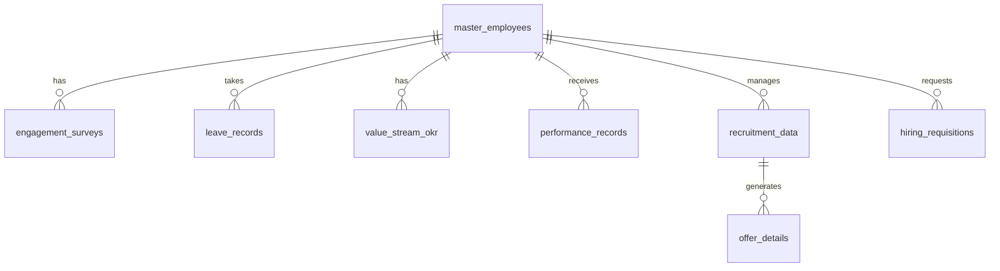

# HR OneMind Database Metadata Documentation

## Table Relationships Overview

## Table Descriptions

### 1. master_employees
**Purpose**: Central repository of all employee information
**Usage**: Primary reference table for employee data across the system
**Key Relationships**: Parent table for most other tables

| Column Name | Data Type | Description | Usage |
|------------|-----------|-------------|--------|
| employee_id | TEXT (PK) | Unique identifier for each employee | Primary key, referenced by other tables |
| name | TEXT | Full name of the employee | Display and identification |
| email | TEXT | Corporate email address | Communication and unique identification |
| gender | TEXT | Gender identity | Diversity metrics and analytics |
| location | TEXT | Primary work location | Geographic distribution analysis |
| department | TEXT | Main department | Organizational structure |
| sub_department | TEXT | Specific team or unit | Detailed organizational grouping |
| role | TEXT | Job title/role | Position identification |
| grade | TEXT | Employee grade/level | Hierarchical classification |
| level | TEXT | Seniority level | Career progression tracking |
| status | TEXT | Employment status (Active/Inactive) | Current employment state |
| joining_date | DATE | Start date of employment | Tenure calculations |
| total_experience | FLOAT | Years of total work experience | Experience metrics |
| manager_id | TEXT (FK) | Reference to reporting manager | Organizational hierarchy |

### 2. engagement_surveys
**Purpose**: Track employee engagement and satisfaction metrics
**Usage**: Monitor employee well-being and engagement trends
**Parent Table**: master_employees

| Column Name | Data Type | Description | Usage |
|------------|-----------|-------------|--------|
| id | INTEGER (PK) | Unique survey response ID | Internal reference |
| employee_id | TEXT (FK) | Employee identifier | Link to master_employees |
| survey_date | DATE | Date of survey completion | Temporal analysis |
| engagement_score | FLOAT | Overall engagement metric | Engagement tracking |
| satisfaction_score | FLOAT | Job satisfaction metric | Satisfaction monitoring |
| burnout_risk | TEXT | Risk level assessment | Well-being monitoring |
| comments | TEXT | Qualitative feedback | Detailed insights |

### 3. leave_records
**Purpose**: Track employee leave and time-off
**Usage**: Leave management and attendance tracking
**Parent Table**: master_employees

| Column Name | Data Type | Description | Usage |
|------------|-----------|-------------|--------|
| id | INTEGER (PK) | Unique leave record ID | Internal reference |
| employee_id | TEXT (FK) | Employee identifier | Link to master_employees |
| leave_type | TEXT | Category of leave | Leave classification |
| start_date | DATE | Leave start date | Duration calculation |
| end_date | DATE | Leave end date | Duration calculation |
| duration | FLOAT | Total days of leave | Leave quota management |
| status | TEXT | Approval status | Leave tracking |
| approval_date | DATE | Date of approval | Process tracking |

### 4. value_stream_okr
**Purpose**: Track Objectives and Key Results
**Usage**: Performance and goal tracking
**Parent Table**: master_employees

| Column Name | Data Type | Description | Usage |
|------------|-----------|-------------|--------|
| id | INTEGER (PK) | Unique OKR ID | Internal reference |
| employee_id | TEXT (FK) | Employee identifier | Link to master_employees |
| quarter | TEXT | Target quarter | Time period tracking |
| year | INTEGER | Target year | Annual tracking |
| objective | TEXT | Main objective | Goal definition |
| key_result | TEXT | Measurable outcome | Success metric |
| status | TEXT | Current status | Progress tracking |
| completion_percentage | FLOAT | Progress metric | Achievement measurement |

### 5. recruitment_data
**Purpose**: Track recruitment processes
**Usage**: Hiring pipeline management
**Parent Table**: master_employees (hiring_manager)

| Column Name | Data Type | Description | Usage |
|------------|-----------|-------------|--------|
| requisition_id | TEXT (PK) | Unique requisition ID | Primary identifier |
| position_title | TEXT | Job title | Position tracking |
| department | TEXT | Target department | Organizational placement |
| location | TEXT | Job location | Geographic tracking |
| experience_required | FLOAT | Required years of experience | Candidate filtering |
| status | TEXT | Current status | Process tracking |
| opening_date | DATE | Position opening date | Timeline tracking |
| closing_date | DATE | Position closing date | Timeline tracking |
| hiring_manager_id | TEXT (FK) | Manager responsible | Process ownership |

### 6. offer_details
**Purpose**: Track job offers and acceptances
**Usage**: Offer management and conversion tracking
**Parent Table**: recruitment_data

| Column Name | Data Type | Description | Usage |
|------------|-----------|-------------|--------|
| offer_id | TEXT (PK) | Unique offer ID | Primary identifier |
| requisition_id | TEXT (FK) | Related requisition | Link to recruitment |
| candidate_name | TEXT | Candidate's name | Identification |
| offer_date | DATE | Date offer extended | Timeline tracking |
| status | TEXT | Offer status | Process tracking |
| joining_date | DATE | Expected start date | Onboarding planning |
| offered_salary | FLOAT | Compensation offered | Budget tracking |
| accepted_date | DATE | Date of acceptance | Conversion tracking |

### 7. hiring_requisitions
**Purpose**: Track new position requests
**Usage**: Hiring process initiation and approval
**Parent Table**: master_employees (hiring_manager)

| Column Name | Data Type | Description | Usage |
|------------|-----------|-------------|--------|
| requisition_id | TEXT (PK) | Unique requisition ID | Primary identifier |
| position_title | TEXT | Job title | Position tracking |
| department | TEXT | Target department | Organizational placement |
| sub_department | TEXT | Specific team | Detailed placement |
| location | TEXT | Job location | Geographic tracking |
| budget_range | TEXT | Salary range | Budget planning |
| status | TEXT | Approval status | Process tracking |
| created_date | DATE | Request date | Timeline tracking |
| approved_date | DATE | Approval date | Process tracking |
| hiring_manager_id | TEXT (FK) | Requesting manager | Process ownership |

### 8. performance_records
**Purpose**: Track employee performance reviews
**Usage**: Performance management and evaluation
**Parent Table**: master_employees

| Column Name | Data Type | Description | Usage |
|------------|-----------|-------------|--------|
| id | INTEGER (PK) | Unique review ID | Internal reference |
| employee_id | TEXT (FK) | Employee identifier | Link to master_employees |
| review_period | TEXT | Review timeframe | Period identification |
| review_year | INTEGER | Year of review | Annual tracking |
| rating | FLOAT | Performance rating | Performance metric |
| reviewer_id | TEXT (FK) | Reviewing manager | Review ownership |
| review_type | TEXT | Category of review | Review classification |
| review_date | DATE | Date of review | Timeline tracking |
| comments | TEXT | Performance feedback | Detailed insights |

## Data Relationships and Dependencies

1. **Employee Hierarchy**
   - Self-referential relationship in master_employees through manager_id
   - Used for organizational structure and reporting lines

2. **Performance Management**
   - performance_records links to both employee and reviewer
   - value_stream_okr tracks individual objectives and results

3. **Recruitment Pipeline**
   - hiring_requisitions initiates the process
   - recruitment_data tracks the open positions
   - offer_details represents the final stage

4. **Employee Well-being**
   - engagement_surveys tracks satisfaction and burnout
   - leave_records monitors time-off patterns

## Data Integrity Rules

1. All employee-related records must reference a valid employee_id
2. Dates should follow ISO format (YYYY-MM-DD)
3. Numeric scores (ratings, percentages) should be normalized (0-5 or 0-100)
4. Status fields should use consistent enumerated values
5. All foreign key relationships must be maintained 